# SignLearn BISINDO AI

Layanan FastAPI dan pipeline machine learning untuk mengenali alfabet statis
BISINDO A-Z dari landmark tangan MediaPipe.

[Kembali ke dokumentasi utama](../README.md)

## Gambaran umum

Modul ini memiliki dua tanggung jawab terpisah:

1. **Inference service** — menerima gambar dari browser, mengekstrak landmark,
   dan mengembalikan probabilitas kelas.
2. **Training/evaluation pipeline** — memuat korpus, membuat split bebas
   kebocoran, melatih model, dan mengevaluasinya per huruf.

Frontend berkomunikasi langsung dengan layanan ini. Backend Express tidak
menerima atau meneruskan frame kamera.

## Tujuan AI

- Mengenali satu huruf alfabet BISINDO statis per frame.
- Mendukung satu atau dua tangan dengan input berdimensi tetap.
- Mengembalikan probabilitas lengkap agar frontend dapat melakukan smoothing dan
  voting temporal.
- Menjaga agar model yang dikirim adalah persis model yang angkanya dilaporkan.

Model ini tidak mengenali kata kontinu, gerakan dinamis, ekspresi wajah, atau
tata bahasa BISINDO. Pembentukan teks dan spasi dilakukan di frontend.

## Arsitektur inferensi

```mermaid
flowchart LR
    browser["Browser webcam"] -->|"JPEG image body"| api["POST /api/v1/predict"]
    api --> validation["Content type dan size validation"]
    validation --> mp["MediaPipe Hands<br/>maks. 2 tangan"]
    mp --> iso["Koreksi aspect ratio<br/>ke satuan isotropik"]
    iso --> features["1.179 fitur geometri"]
    features --> classifier["Calibrated RBF SVM"]
    classifier --> response["Label, confidence,<br/>probabilities, top-2 margin"]
    response --> stabilizer["Frontend EMA + voting<br/>+ release lock"]
```



MediaPipe Hands memiliki state tracking dan tidak thread-safe. `BisindoClassifier`
melindungi ekstraksi serta model call dengan satu lock.

## Struktur direktori

```text
ai/
├── app/
│   ├── main.py             # FastAPI app dan endpoint
│   ├── config.py           # Environment settings
│   ├── landmarks.py        # MediaPipe, koreksi aspect, fitur geometri
│   └── classifier.py       # Pemuatan bundle dan inference
├── data/
│   ├── raw/                # Korpus hasil download; diabaikan Git
│   ├── cache/              # Landmark cache; diabaikan Git
│   ├── real_world/         # Validasi webcam sendiri; diabaikan Git
│   └── DATASET.md          # Provenance dan kebijakan split
├── models/
│   ├── bisindo_geometry_v6.pkl   # Model produksi
│   ├── model_metadata.json
│   └── README.md                 # Provenance dan hasil terverifikasi
├── reports/
│   └── production_v6.json  # Audit training/evaluasi lengkap
├── training/
│   ├── corpora.py          # Loader tiap korpus + split + higienis
│   ├── train_production.py # Training dan evaluasi jujur
│   ├── evaluate_model.py   # Skor per huruf atas bundle yang dikirim
│   └── capture_webcam.py   # Perekam set validasi webcam
├── tests/
└── requirements.txt
```

## Model produksi

| Properti | Nilai |
| --- | --- |
| File | `models/bisindo_geometry_v6.pkl` |
| Tipe | Calibrated `SVC` RBF (`C=10`) di atas `StandardScaler` |
| Kelas | A-Z (26 kelas) |
| Input | 1.179 nilai floating point |
| Feature schema | `bisindo-geometry-v6` |
| Acceptance policy | confidence `0,68`, margin `0,0` |
| Refit pada data evaluasi | tidak |

### Hasil terverifikasi

Diukur dengan `npm run ai:evaluate` terhadap artifact yang dikirim:

| Domain uji | n | Accuracy | Macro F1 | Huruf < 0,90 |
| --- | ---: | ---: | ---: | --- |
| Talkee held-out (mirip webcam) | 1.560 | **0,9942** | 0,9942 | **tidak ada** |
| Kaggle held-out (close-up, kamera miring) | 93 | 0,7742 | 0,7544 | 12 |
| Mendeley held-out (fisheye jarak jauh) | 770 | 0,7636 | 0,7481 | 13 |

Pada domain webcam, seluruh huruf mencapai recall `1,00` kecuali M `0,93`,
J `0,97`, Y `0,97`, dan R `0,98`. Dengan acceptance policy: accepted accuracy
`0,9994` pada coverage `0,9897`.

Sebagai pembanding, model v5 sebelumnya mencapai `0,7467` pada test-nya dengan
**P dan S di recall `0,00`**.

## Yang membuat v5 hanya menguasai 18 huruf

Akar masalahnya bukan arsitektur model atau hyperparameter. Di dalam satu sesi
rekaman, 1-NN sederhana atas fitur yang sama sudah mencapai 97-99%, jadi
informasinya selalu ada. Yang salah adalah data latihnya.

Enam belas huruf BISINDO memakai dua tangan. Pada korpus Mendeley — kamera
fisheye dengan penanda duduk jauh, tangan hanya 13,8% lebar frame — MediaPipe
**sering hanya menemukan satu tangan**. Ketika itu terjadi, blok
`cross_distances` dan `pair`, yaitu 504 dari 1.179 fitur, serentak menjadi nol
sementara labelnya tetap huruf penuh. Sekitar 57% data latih "P" berupa artefak
satu tangan seperti ini, sehingga kelas P runtuh seluruhnya ke Q pada signer
baru.

Rasio sampel yang jumlah tangannya cocok dengan hurufnya: Talkee 99,1%,
Kaggle 68,7%, Mendeley 61,7%.

Tiga cacat lain ikut diperbaiki:

- **Aspect ratio tidak dikoreksi.** MediaPipe membagi `x` dengan lebar dan `y`
  dengan tinggi, sehingga frame 4:3 meregangkan tangan dibanding webcam 16:9.
  Rasio anatomi lebar telapak terhadap panjang telunjuk terbaca 0,807 pada
  gambar persegi, 0,723 pada 4:3, dan 0,662 pada Talkee — bukti langsung
  distorsinya.
- **Model yang dikirim di-refit pada train+val+test**, sehingga angka yang
  dipublikasikan menggambarkan model yang tidak pernah di-deploy.
- **Threshold rejection dikalibrasi pada model yang berbeda** dan membuang 55%
  frame.

Hipotesis yang diuji dan **terbantahkan**, agar tidak dicoba ulang: mirror
augmentation tidak menabrakkan kelas mana pun; normalisasi rotasi justru
menurunkan skor; augmentasi rotasi/anisotropi/noise tidak memperbaiki transfer
lintas domain; deteksi dua tahap hanya menaikkan kecocokan jumlah tangan dari
63,1% ke 66,9%.

## Preprocessing

Landmark dikonversi ke **satuan isotropik** tepat saat keluar dari MediaPipe,
yaitu `y` dikalikan tinggi/lebar sehingga kedua sumbu menjadi fraksi lebar
frame. Karena dilakukan di titik paling awal, seluruh besaran hilir — palm
scale, arah tulang, jarak berpasangan, dan gap tangan pasif — otomatis benar
secara geometris dan sebanding antar kamera.

Fitur `bisindo-geometry-v6` (1.179 nilai):

| Blok | Dimensi | Isi |
| --- | ---: | --- |
| `local` | 126 | Pose tiap tangan, berpusat di pergelangan, dibagi palm scale |
| `bone` | 126 | Vektor satuan tiap tulang |
| `intra` | 420 | Jarak antar landmark dalam satu tangan |
| `cross` | 441 | Jarak kontak antar dua tangan |
| `pair` | 63 | Perpindahan antar tangan |
| `masks` + count | 3 | Kehadiran tangan |

Tangan pasif yang jauh dibuang bila gap melebihi 1,5 kali palm scale; tanpa
pruning ini akurasi Mendeley turun 14 poin karena grup AR memuat dua orang
dalam satu frame.

## Dataset dan split

Detail lengkap di [`data/DATASET.md`](data/DATASET.md).

| Korpus | Peran | Unit yang ditahan |
| --- | --- | --- |
| Talkee | korpus utama, domain webcam | sequence utuh |
| Kaggle | ragam close-up | gambar, rotasi deterministik |
| Mendeley | ragam signer, stress test | capture/signer group utuh |

Tidak ada split yang memotong bagian dalam satu sesi rekaman.

**Higienis jumlah tangan hanya untuk data latih.** Sampel yang jumlah tangannya
bertentangan dengan hurufnya dibuang dari training, tetapi val dan test dinilai
utuh — di aplikasi, frame tempat MediaPipe kehilangan satu tangan tetap sampai
ke model dan tetap menampilkan huruf. Report memisahkan keduanya lewat
`accuracy_when_hands_seen` dan `accuracy_when_a_hand_was_missed`.

## Training

```bash
npm run ai:train
```

Menulis `models/bisindo_geometry_v6.pkl` dan `reports/production_v6.json`.
Ekstraksi MediaPipe di-cache; gunakan `--rebuild-cache` bila kode landmark
berubah.

Pemilihan `C` dilakukan pada validation, acceptance threshold dikalibrasi pada
validation, lalu test dijalankan sekali. Artifact disimpan **tanpa** refit pada
val atau test.

Acceptance threshold dipilih sebagai coverage tertinggi yang masih mencapai
`--target-accuracy` (default `0,975`), dengan syarat tidak ada satu huruf pun
yang coverage-nya jatuh di bawah `--min-letter-coverage` (default `0,40`).
Syarat kedua mencegah kasus yang disembunyikan threshold global: kebijakan bisa
mencapai 98% keseluruhan sementara satu huruf sulit nyaris tidak pernah
diterima, yang membuat pelajaran huruf itu mustahil diselesaikan.

## Evaluasi

```bash
npm run ai:evaluate
```

Melaporkan recall ke-26 huruf, confusion teratas, dan coverage per huruf, lalu
keluar dengan status bukan nol bila ada huruf di bawah `--min-recall`.

## Validasi webcam nyata

Seluruh korpus adalah rekaman orang lain dengan kamera lain. **Validasi lintas
pengguna pada webcam sebenarnya belum dilakukan**; angka 0,9942 berarti "penanda
yang mungkin sama, rekaman baru".

```bash
npm run ai:capture     # rekam A-Z dari webcam sendiri
npm run ai:validate    # skor per huruf terhadap rekaman itu
```

Perekam menolak menyimpan frame yang jumlah tangannya tidak sesuai huruf,
sehingga set validasi tidak mengulang kerusakan yang dulu merusak model. Hasil
rekaman disimpan di `data/real_world/` dan diabaikan Git karena berisi foto
orang; laporan evaluasinya yang layak dibagikan. Jangan memasukkan set ini ke
data latih — begitu dilatih, ia berhenti menjadi bukti.

## Inference API

### `GET /api/health`

```json
{
  "status": "ok",
  "service": "signlearn-bisindo-ai",
  "modelLoaded": true,
  "model": {
    "name": "rbf_svc_bisindo_geometry",
    "version": "6.0.0-2026-08-16",
    "featureSchema": "bisindo-geometry-v6",
    "classes": 26,
    "rejection": { "min_confidence": 0.68, "min_margin": 0.0 }
  }
}
```

### `POST /api/v1/predict`

Body berisi byte gambar secara langsung, `Content-Type` harus dimulai dengan
`image/`, dan ukurannya tidak melebihi `AI_MAX_IMAGE_BYTES`.

```bash
curl -X POST http://localhost:8000/api/v1/predict \
  -H "Content-Type: image/jpeg" \
  --data-binary @frame.jpg
```

```json
{
  "detected": true,
  "accepted": true,
  "label": "S",
  "confidence": 0.982,
  "handsDetected": 2,
  "relevantHands": 2,
  "handSpan": 0.31,
  "probabilities": { "S": 0.982, "C": 0.007 },
  "secondLabel": "C",
  "margin": 0.975,
  "rejectionReason": null,
  "expectedHands": 2,
  "handCountMismatch": false
}
```

`expectedHands` adalah jumlah tangan yang dibutuhkan huruf **yang diprediksi**,
dan `handCountMismatch` menandai bahwa jumlah itu berbeda dari yang terlihat.
Keduanya bersifat informatif dan tidak memveto prediksi: memblokir kelas yang
tidak cocok sudah diukur dan justru menurunkan akurasi, karena model lebih sering
pulih dari tangan yang terlewat daripada yang diizinkan oleh pemblokiran itu.

Untuk memandu pengguna pada pelajaran huruf tertentu, bandingkan `relevantHands`
di frontend dengan jumlah tangan huruf yang sedang diajarkan — frontend tahu
targetnya, API tidak.

| Status | Kondisi |
| --- | --- |
| `400` | Body kosong atau gambar tidak dapat didekode |
| `413` | Gambar melewati batas ukuran |
| `415` | `Content-Type` bukan gambar |
| `503` | Classifier belum siap |

## Environment variables

| Variabel | Default | Fungsi |
| --- | --- | --- |
| `BISINDO_MODEL_PATH` | `models/bisindo_geometry_v6.pkl` | Path model relatif terhadap `ai/` atau absolut |
| `AI_CORS_ORIGINS` | origin frontend lokal | Allowlist origin browser |
| `AI_MAX_IMAGE_BYTES` | `2000000` | Batas body gambar |
| `AI_MIN_DETECTION_CONFIDENCE` | `0.5` | Threshold deteksi MediaPipe |
| `AI_MIN_TRACKING_CONFIDENCE` | `0.5` | Threshold tracking MediaPipe |
| `BISINDO_MIN_HAND_SPAN` | `0.06` | Tangan terkecil yang diterima, fraksi lebar frame |

## Persyaratan dan instalasi

- Python 3.10-3.12; 3.12 direkomendasikan.

```bash
py -3.12 -m venv ai/.venv          # Windows PowerShell
ai/.venv/Scripts/Activate.ps1
pip install -r ai/requirements.txt
Copy-Item ai/.env.example ai/.env
```

```bash
python3.12 -m venv ai/.venv        # macOS/Linux
source ai/.venv/bin/activate
pip install -r ai/requirements.txt
cp ai/.env.example ai/.env
```

## Menjalankan layanan

```bash
npm run dev:ai      # hanya AI
npm run dev         # seluruh sistem
npm run ai:test     # test suite AI
```

## Integrasi frontend

Pada development, `frontend/vite.config.js` meneruskan
`/bisindo-ai/predict` ke `http://127.0.0.1:8000/api/v1/predict`.

`VITE_BISINDO_MIN_CONFIDENCE` di frontend **harus sama dengan** `min_confidence`
di dalam bundle (terlihat pada `GET /api/health`). Menyetelnya lebih tinggi
tidak membuat aplikasi lebih akurat; ia hanya membuang prediksi yang sudah
terbukti benar. Ketika model dilatih ulang dan threshold-nya berubah, perbarui
[`frontend/src/features/bisindo/detectionConfig.js`](../frontend/src/features/bisindo/detectionConfig.js)
bersamaan.

## Troubleshooting

### `... predates feature schema bisindo-geometry-v6`

Artifact lama (`rf_bisindo_99.pkl`, `bisindo_geometry_v5.pkl`) dilatih sebelum
koreksi aspect ratio. Bentuk fiturnya masih cocok sehingga tidak akan error —
ia hanya salah secara diam-diam. Arahkan `BISINDO_MODEL_PATH` ke bundle v6.

### `Model feature schema does not match runtime`

Bundle dan `app/landmarks.py` tidak sinkron. Latih ulang; jangan menonaktifkan
validasinya.

### Banyak frame tidak mendeteksi tangan

Perbaiki pencahayaan dan pastikan kedua tangan utuh dalam frame. Untuk 16 huruf
dua tangan, satu tangan yang terlewat membuat 504 fitur menjadi nol dan
prediksinya tidak dapat dipercaya. Duduk lebih dekat ke kamera membantu:
kegagalan deteksi meningkat tajam ketika tangan mengecil di frame.

### Akurasi bagus di dataset tetapi buruk di webcam

Itu tepat gejala yang diperbaiki rilis ini, dan satu-satunya cara mengukurnya
adalah dengan data sendiri: `npm run ai:capture` lalu `npm run ai:validate`.

## Dokumentasi terkait

- [Dokumentasi utama](../README.md)
- [Dataset dan kebijakan split](data/DATASET.md)
- [Provenance model](models/README.md)
- [Frontend](../frontend/README.md)
