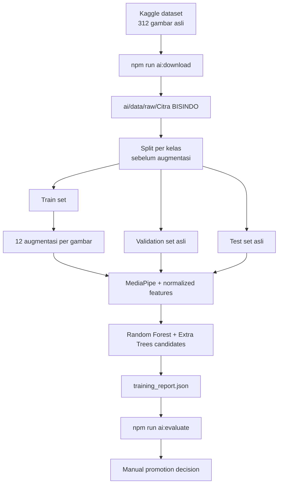

# SignLearn BISINDO AI

Layanan FastAPI dan pipeline machine learning untuk mengenali alfabet statis BISINDO A-Z dari landmark tangan MediaPipe.

[Kembali ke dokumentasi utama](../README.md)

## Gambaran umum

Modul ini memiliki dua tanggung jawab terpisah:

1. **Inference service** — menerima gambar dari browser, mengekstrak landmark, dan mengembalikan probabilitas kelas.
2. **Training/evaluation pipeline** — mengunduh dataset, membuat split leakage-safe, melatih model kandidat, dan membandingkannya dengan model produksi.

Frontend berkomunikasi langsung dengan layanan ini. Backend Express tidak menerima atau meneruskan frame kamera.

## Tujuan AI

- Mengenali satu huruf alfabet BISINDO statis per frame.
- Mendukung satu atau dua tangan dengan input berdimensi tetap.
- Mengembalikan probabilitas lengkap agar frontend dapat melakukan smoothing dan voting temporal.
- Memisahkan model kandidat dari model produksi agar retraining tidak menyebabkan deployment tidak disengaja.

Model ini tidak mengenali kata kontinu, gerakan dinamis, ekspresi wajah, atau tata bahasa BISINDO. Pembentukan teks dan spasi dilakukan di frontend.

## Arsitektur inferensi

```mermaid
flowchart LR
    browser["Browser webcam"] -->|"JPEG image body"| api["POST /api/v1/predict"]
    api --> validation["Content type dan size validation"]
    validation --> mp["MediaPipe Hands<br/>maks. 2 tangan"]
    mp --> features["126 fitur<br/>2 × 21 × x-y-z"]
    features --> classifier["scikit-learn classifier"]
    classifier --> response["Label, confidence,<br/>probabilities, top-2 margin"]
    response --> stabilizer["Frontend EMA + voting<br/>+ release lock"]
```



MediaPipe Hands memiliki state tracking dan tidak thread-safe. `BisindoClassifier` melindungi ekstraksi serta model call dengan satu lock.

## Struktur direktori

```text
ai/
├── app/
│   ├── main.py             # FastAPI app dan endpoint
│   ├── config.py           # Environment settings
│   └── classifier.py       # MediaPipe dan inference model
├── data/
│   ├── raw/                # Dataset hasil download; diabaikan Git
│   ├── splits/             # Manifest split lokal; diabaikan Git
│   └── DATASET.md          # Provenance dataset
├── models/
│   ├── rf_bisindo_99.pkl   # Model produksi
│   ├── labels.json
│   ├── model_metadata.json
│   ├── candidates/         # Model hasil training; file model diabaikan Git
│   └── README.md           # Provenance model produksi
├── reports/
│   ├── model_comparison.json
│   └── *_confusion_matrix.csv
├── training/
│   ├── download_dataset.py
│   ├── dataset.py
│   ├── augment.py
│   ├── features.py
│   ├── train.py
│   └── evaluate.py
├── .env.example
└── requirements.txt
```

## Model produksi

| Properti | Nilai |
| --- | --- |
| File | `models/rf_bisindo_99.pkl` |
| Tipe | `RandomForestClassifier` scikit-learn |
| Kelas | A-Z (26 kelas) |
| Input | 126 nilai floating point |
| Fitur | Maks. 2 tangan × 21 landmark × koordinat x, y, z |
| Preprocessing | Mode `legacy`: koordinat absolut MediaPipe dan zero padding |
| Framework artefak | scikit-learn 1.5.2 |

Jika hanya satu tangan terdeteksi, slot fitur yang tersisa diisi nol. Model produksi memakai urutan deteksi legacy. Jangan mengaktifkan `BISINDO_FEATURE_MODE=normalized` dengan model produksi karena representasi fiturnya berbeda dari saat model tersebut dilatih.

Provenance dan lisensi sumber model tersedia di [`models/README.md`](models/README.md) dan [`models/SOURCE_LICENSE.txt`](models/SOURCE_LICENSE.txt).

## Dataset

| Properti | Nilai yang tercatat |
| --- | --- |
| Sumber | Kaggle `achmadnoer/alfabet-bisindo` |
| Judul | Bahasa Isyarat Indonesia (BISINDO) Alphabets |
| Kelas | 26 kelas A-Z |
| Gambar asli | 312 (12 per kelas) |
| Lisensi dataset | CC0 — Public Domain |

Detail provenance tersedia di [`data/DATASET.md`](data/DATASET.md).

Dataset mentah tidak di-commit karena ukuran dan karena tidak dibutuhkan untuk inference. `.gitignore` mengecualikan:

- `ai/data/raw/**` selain `.gitkeep`;
- `ai/data/splits/*.json`;
- model `.pkl`/`.npz` di `ai/models/candidates/`;
- credential `kaggle.json` jika ada.

Downloader memakai endpoint publik dataset dan tidak membaca `kaggle.json`.

## Dataset download

Dari root repository, setelah virtual environment siap:

```bash
npm run ai:download
```

Perintah mengekstrak dataset ke `ai/data/raw/`. Script training root mengharapkan direktori gambar pada:

```text
ai/data/raw/Citra BISINDO/
```

Setiap direktori kelas harus bernama satu huruf A-Z. File yang dikenali adalah `.jpg`, `.jpeg`, dan `.png`.

## Preprocessing

### Produksi legacy

- MediaPipe menerima gambar RGB.
- Maksimum dua tangan diambil.
- Tiap landmark menyediakan x, y, dan z.
- Fitur diratakan secara posisi menjadi 126 nilai.
- Slot tangan yang kosong di-zero-pad.

### Kandidat normalized

Pipeline v2:

- menstabilkan urutan tangan berdasarkan handedness kiri/kanan;
- mengurangi setiap landmark dengan posisi pergelangan tangan;
- membagi koordinat dengan span terbesar bounding box tangan pada bidang x-y;
- mempertahankan zero padding hingga 126 fitur.

Mode inference harus cocok dengan mode preprocessing model yang dipilih.

## Data augmentation

`augment_webcam` hanya diterapkan pada data train dan menghasilkan variasi ringan kondisi webcam:

- rotasi `-12°` sampai `12°`;
- scale `0.92` sampai `1.08`;
- translasi hingga sekitar 4% dimensi;
- perubahan brightness/contrast;
- blur ringan;
- noise Gaussian;
- kompresi JPEG quality 70-93.

Horizontal flip sengaja tidak digunakan karena dapat mengubah makna handedness/isyarat.

## Dataset splitting

Split dibuat per kelas dengan seed bawaan `42` sebelum augmentasi. Untuk setiap kelas, sekitar 17% dialokasikan ke test dan 17% ke validation; sisanya menjadi train.

Artefak training yang di-commit mencatat:

| Split | Gambar asli pada manifest | Sampel dengan landmark setelah proses |
| --- | ---: | ---: |
| Train | 208 | 2.444, termasuk varian augmentasi |
| Validation | 52 | 43 |
| Test | 52 | 49 |

Manifest dibuat sekali bila belum ada. Karena menyimpan path lokal, file tersebut diabaikan Git.

## Pipeline training



Jalankan training:

```bash
npm run ai:train
```

Konfigurasi root saat ini:

- 12 augmentasi per gambar train;
- 400 estimator untuk Random Forest;
- 400 estimator untuk Extra Trees;
- `class_weight="balanced"`;
- `n_jobs=-1`;
- pemilihan kandidat berdasarkan macro F1 validation tertinggi.

Output:

```text
ai/models/candidates/
├── random_forest_normalized.pkl
├── extra_trees_normalized.pkl
├── training_report.json
└── heldout_features.npz
```

Model dan heldout features bersifat lokal/tergenerasi; `training_report.json` dapat menyimpan ringkasan tanpa menyimpan dataset mentah.

## Evaluasi

```bash
npm run ai:evaluate
```

Perintah root membandingkan:

- model produksi legacy `ai/models/rf_bisindo_99.pkl` dengan fitur legacy;
- kandidat `ai/models/candidates/extra_trees_normalized.pkl` dengan fitur normalized.

Keduanya diuji pada split gambar asli yang sama. Latency pada laporan hanya mengukur `model.predict()`; waktu deteksi MediaPipe, transfer gambar, dan stabilisasi frontend tidak termasuk.

### Hasil artefak saat ini

Ringkasan berikut berasal dari [`reports/model_comparison.json`](reports/model_comparison.json):

| Model | Sampel terdeteksi | Accuracy | Macro F1 | Weighted F1 |
| --- | ---: | ---: | ---: | ---: |
| Produksi Random Forest legacy | 49 | 0,9796 | 0,9787 | 0,9782 |
| Kandidat Extra Trees normalized | 49 | 0,9388 | 0,9307 | 0,9361 |

Artefak menetapkan `production_replacement_recommended: false` karena macro F1 kandidat lebih rendah.

Angka tersebut adalah evaluasi offline pada 49 gambar test yang landmark-nya berhasil diekstrak, bukan jaminan performa pada webcam dunia nyata. Metadata model legacy juga memperingatkan bahwa metrik training lama memakai split setelah augmentasi dan dapat terlalu optimistis. Gunakan laporan perbandingan leakage-safe di atas untuk keputusan antarmodel.

Evaluasi juga menghasilkan:

- classification report per kelas di JSON;
- confusion matrix CSV untuk model lama dan baru;
- distribusi confidence/margin prediksi benar dan salah;
- calibration grid untuk kombinasi confidence dan margin;
- ukuran model dan latency classifier.

## Keamanan promosi model produksi

Training dan evaluasi tidak mengganti `models/rf_bisindo_99.pkl`. Promosi harus menjadi keputusan manual setelah meninjau:

- macro F1 dan confusion matrix test asli;
- kegagalan deteksi MediaPipe;
- distribusi confidence dan margin;
- ukuran/latency model;
- pengujian webcam lintas pengguna, pencahayaan, latar, dan perangkat.

Jika model normalized dipromosikan, `BISINDO_MODEL_PATH` dan `BISINDO_FEATURE_MODE=normalized` harus diubah bersama. Mengganti hanya salah satunya membuat input inference tidak cocok dengan training.

## Inference API

### `GET /api/health`

Contoh respons:

```json
{
  "status": "ok",
  "service": "signlearn-bisindo-ai",
  "modelLoaded": true
}
```

### `POST /api/v1/predict`

Request:

- body berisi byte gambar secara langsung;
- `Content-Type` harus dimulai dengan `image/`;
- ukuran tidak boleh melebihi `AI_MAX_IMAGE_BYTES`;
- bukan JSON dan bukan multipart form.

Contoh dengan curl:

```bash
curl -X POST http://localhost:8000/api/v1/predict \
  -H "Content-Type: image/jpeg" \
  --data-binary @frame.jpg
```

Contoh respons ketika tangan terdeteksi:

```json
{
  "detected": true,
  "accepted": true,
  "label": "A",
  "confidence": 0.97,
  "handsDetected": 2,
  "relevantHands": 2,
  "handSpan": 0.16,
  "probabilities": {
    "A": 0.97,
    "B": 0.01
  },
  "secondLabel": "B",
  "margin": 0.96,
  "rejectionReason": null
}
```

Ketika tidak ada tangan, `detected` bernilai `false`, label/secondLabel bernilai `null`, dan probabilities kosong.

Kemungkinan error:

| Status | Kondisi |
| --- | --- |
| `400` | Body kosong atau gambar tidak dapat didekode |
| `413` | Gambar melewati batas ukuran |
| `415` | `Content-Type` bukan gambar |
| `503` | Classifier belum siap |

OpenAPI interaktif tersedia di `http://localhost:8000/docs` ketika service aktif.

## Environment variables

| Variabel | Default/template | Fungsi |
| --- | --- | --- |
| `BISINDO_MODEL_PATH` | `models/rf_bisindo_99.pkl` | Path model relatif terhadap `ai/` atau absolut |
| `BISINDO_FEATURE_MODE` | `legacy` | `legacy` untuk produksi; `normalized` untuk kandidat v2 |
| `AI_CORS_ORIGINS` | origin frontend lokal | Allowlist origin browser |
| `AI_MAX_IMAGE_BYTES` | `2000000` | Batas body gambar |
| `AI_MIN_DETECTION_CONFIDENCE` | `0.5` | Threshold deteksi MediaPipe |
| `AI_MIN_TRACKING_CONFIDENCE` | `0.5` | Threshold tracking MediaPipe |

Gunakan [`.env.example`](.env.example); jangan commit konfigurasi rahasia atau URL internal yang sensitif.

## Persyaratan dan instalasi

- Python 3.10-3.12; 3.12 direkomendasikan.
- Model produksi tersedia pada `ai/models/rf_bisindo_99.pkl`.

macOS/Linux dari root repository:

```bash
python3.12 -m venv ai/.venv
source ai/.venv/bin/activate
pip install -r ai/requirements.txt
cp ai/.env.example ai/.env
deactivate
```

Windows PowerShell:

```powershell
py -3.12 -m venv ai/.venv
ai/.venv/Scripts/Activate.ps1
pip install -r ai/requirements.txt
Copy-Item ai/.env.example ai/.env
deactivate
```

## Menjalankan layanan

Dari root:

```bash
npm run dev:ai
```

Atau secara langsung dari `ai/` setelah mengaktifkan virtual environment:

```bash
uvicorn app.main:app --reload --host 127.0.0.1 --port 8000
```

Menjalankan seluruh sistem:

```bash
npm run dev
```

## Integrasi frontend

Pada development, `frontend/vite.config.js` meneruskan:

```text
/bisindo-ai/predict → http://127.0.0.1:8000/api/v1/predict
```

Frontend mengirim satu request pada satu waktu, membatalkan request ketika panel kamera dilepas, dan tidak mengirim frame jika frame sebelumnya belum selesai. Tuning acceptance berada di variabel `VITE_BISINDO_*`, bukan di service AI.

## Validasi dunia nyata

Untuk dataset webcam terpisah, simpan gambar menurut label di:

```text
ai/data/real_world/<LABEL>/
```

Jangan campurkan gambar validasi dunia nyata ke train set. Repository belum menyediakan script evaluasi khusus direktori tersebut; validasi lintas pengguna/perangkat masih merupakan pekerjaan manual.

## Troubleshooting

### `BISINDO model not found`

Pastikan path model benar dan relatif terhadap direktori `ai/`. Model produksi harus berada pada `ai/models/rf_bisindo_99.pkl` dengan template bawaan.

### `Model expects ... features; expected 126`

Artefak model tidak kompatibel dengan extractor saat ini. Gunakan model yang dilatih dengan 126 fitur atau perbarui pipeline secara terkoordinasi; jangan menonaktifkan validasi jumlah fitur.

### Service hidup tetapi frontend tidak dapat memanggilnya

- Periksa `http://localhost:8000/api/health`.
- Saat development, kosongkan `VITE_BISINDO_AI_URL` agar proxy Vite digunakan.
- Jika frontend mengakses AI secara langsung, tambahkan origin tepat ke `AI_CORS_ORIGINS`.

### Banyak frame tidak mendeteksi tangan

Perbaiki pencahayaan, pastikan tangan utuh berada dalam frame, dan gunakan latar yang cukup kontras. Jangan menurunkan threshold secara agresif tanpa mengevaluasi false positive.

### Training tidak menemukan gambar

Pastikan download selesai, path `ai/data/raw/Citra BISINDO` ada, dan gambar berada di subfolder satu huruf A-Z.

### Evaluasi gagal karena kandidat tidak ada

Jalankan `npm run ai:train` sebelum `npm run ai:evaluate`. File kandidat `.pkl` memang diabaikan Git dan tidak tersedia pada clone baru.

## Dokumentasi terkait

- [Dokumentasi utama](../README.md)
- [Frontend](../frontend/README.md)
- [Backend](../backend/README.md)
- [Dataset](data/DATASET.md)
- [Model provenance](models/README.md)
- [Testing report](../TESTING_REPORT.md)
